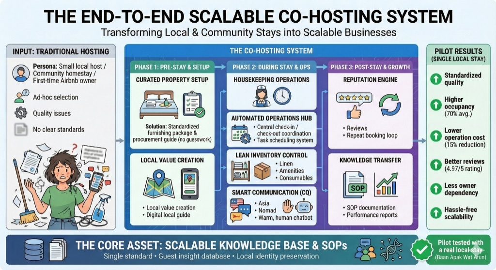

# The End-to-End Scalable Co-Hosting System

> Transforming Local & Community Stays into Scalable Businesses

## Problem: Traditional Hosting

**Persona:** Small local host / Community homestay / First-time Airbnb owner

Pain points:
- Ad-hoc selection of furnishings and amenities
- Quality issues and inconsistency
- No clear standards or processes

---

## The Co-Hosting System

### Phase 1: Pre-Stay & Setup

#### Curated Property Setup
Standardized furnishing package & procurement guide (no guesswork).
- Single standard across all properties
- Consistent guest experience from day one

#### Local Value Creation
- Local value creation through community partnerships
- Digital local guide for guests

### Phase 2: During Stay & Operations

#### Housekeeping Operations
- Standardized cleaning and turnover procedures

#### Automated Operations Hub
- Central check-in / check-out coordination
- Task scheduling system

#### Lean Inventory Control
- Linen tracking and replenishment
- Amenities stock management
- Consumables monitoring with auto-deduct on checkout

#### Smart Communication (CQ)
- Multi-audience communication (Asia, Nomad, etc.)
- Warm, human chatbot for guest interactions

### Phase 3: Post-Stay & Growth

#### Reputation Engine
- Reviews management
- Repeat booking loop to drive return guests

#### Knowledge Transfer
- SOP documentation
- Performance reports for property owners

---

## The Core Asset: Scalable Knowledge Base & SOPs

> Single standard · Guest insight database · Local identity preservation

The foundation that enables scalability — documented processes, guest data, and local character preserved across all properties.

---

## Pilot Results (Single Local Stay)

| Metric | Result |
|--------|--------|
| Quality | Standardized |
| Occupancy | Higher (70% avg.) |
| Operation cost | Lower (15% reduction) |
| Reviews | Better (4.97/5 rating) |
| Owner dependency | Less |
| Scalability | Hassle-free |

> Pilot tested with a real local stay (Baan Apak Wat Arun)

---

## How Air Maps to This System

Air currently implements key parts of this vision:

| System Component | Air Feature | Status |
|-----------------|-------------|--------|
| Curated Property Setup | Property management with platform tagging | ✅ Done |
| Automated Operations Hub | Calendar view, iCal sync, check-in/out tracking | ✅ Done |
| Lean Inventory Control | Full inventory system with stock per property, auto-deduct, low stock alerts | ✅ Done |
| Housekeeping Operations | Housekeeping tasks linked to bookings | ✅ Done |
| Task Scheduling | Maintenance tasks with priority and assignment | ✅ Done |
| Multi-tenant | JWT auth, per-user property isolation | ✅ Done |
| Reputation Engine | Reviews management | 🔲 Planned |
| Smart Communication | Guest chatbot | 🔲 Planned |
| Knowledge Transfer | SOP docs, performance reports | 🔲 Planned |
| Local Value Creation | Digital local guide | 🔲 Planned |
